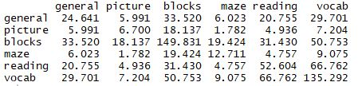

```{r setup, include=FALSE}
knitr::opts_chunk$set(echo = TRUE, fig.align="center")
```

## Agenda

- Conceptual overview of Exploratory Factor Analysis (EFA)
- How to implement in R
- How to interpret
- How to visualize
- Tips and warnings along the way

## A review of covariance and correlation

* EFA involves modeling a covariance or correlation matrix
* Covariance: measure of linear association between two variables
* Correlation: standardized measure of linear association between two variables 
* Positive values mean a positive relationship (as one increases, so does the other)
* Negative values mean a negative relationship (as one increases, the other decreases)
* Covariances and correlations are usually displayed in a _matrix_

## Example of covariance matrix

Ability and Intelligence Tests (see `?ability.cov` in R)



- Notice the matrix is square (equal number of rows and columns)
- Notice the matrix is symmetric (lower left and top right values are equal)
- The diagonal values (top left corner to bottom right corner) are variances
- The off-diagonal values are covariances

## Example of correlation matrix

Same data as previous slide but now expressed as correlations.


- Correlations range from -1 to 1
- Correlation of 1 means a perfectly positive linear relationship
- Correlation of -1 means a perfectly negative linear relationship
- Correlation of 0 means no linear relationship
- There are 1's on the diagonal since since variables are perfectly correlated with themselves

## Be cautious with correlation

Correlation measures strength of _linear_ association. Low correlation doesn't always mean "no relationship". Below: data on bottom row has a relationship not captured with correlation.


Source: https://en.wikipedia.org/wiki/Correlation_and_dependence

## Be cautious with correlation

Correlation measures strength of _linear_ association. High correlation doesn't always mean "linear relationship". Below: Four sets of data with the same correlation of 0.816.

```{r echo=FALSE, fig.dim = c(7,4)}
op <- par(mfrow = c(2, 2), mar = 0.1+c(4,4,1,1), oma =  c(0, 0, 2, 0))
ff <- y ~ x
mods <- setNames(as.list(1:4), paste0("lm", 1:4))
for(i in 1:4) {
  ff[2:3] <- lapply(paste0(c("y","x"), i), as.name)
  mods[[i]] <- lmi <- lm(ff, data = anscombe)
}
for(i in 1:4) {
  ff[2:3] <- lapply(paste0(c("y","x"), i), as.name)
  plot(ff, data = anscombe, col = "red", pch = 21, bg = "orange", cex = 1.2,
       xlim = c(3, 19), ylim = c(3, 13))
  abline(mods[[i]], col = "blue")
}
par(op)
```

Source: https://en.wikipedia.org/wiki/Anscombe%27s_quartet


## Groups of correlations

* Let's say we have a correlation matrix with groups of variables that are highly correlated among themselves but not so much with variables in a different group.
* Then perhaps each group of variables represent a single underlying construct, or _factor_, that is responsible for the observed correlations?


## And now to Exploratory Factor Analysis

* EFA attempts to describe, _if possible_, the covariance/correlation relationships among many variables in terms of a few underlying, _but unobservable_, random quantities called _factors_. (Johnson and Wichern, 2007)
* On the previous slide it appeared that two _latent factors_ could be responsible for the groups of correlations within the matrix
* EFA helps us investigate the possibility that there are one or more factors generating our covariance matrix

## EFA models the covariance matrix

- EFA says we can use the following matrix algebra formula to model our covariance matrix:

$$\Sigma  = LL' + \Psi$$

- $\Sigma$ (sigma) is our covariance matrix

- $L$ is a matrix of unobserved factors, called _loadings_. It will have the same number of rows as our covariance matrix but _fewer columns_. The number of columns is the number of factors.

- $\Psi$ (psi, pronounced "sigh") are the variances unique to each variable in our covariance matrix (ie, error). These are called _uniquenesses_.

- EFA estimates $L$ and $\Psi$ for a specified number of groups


## Performing EFA in R

* We can carry out EFA in R using the `factanal` function
* The `psych` package also provides the `fa` function that has a few more options
* The most basic usage is to give the functions a correlation matrix and specify the number of factors
* For example, say we have a correlation matrix called `cor_matrix` and we want to perform an EFA for 2 factors: 
    + `factanal(covmat = cor_matrix, factors = 2)`
    + `fa(r = cor_matrix, nfactors = 2)`


## What `factanal` returns


## What did we just look at?

- The _uniquenesses_ are unexplained variability (0,1); we hope they're small, say less than 0.3
- The _loadings_ are the variables' correlation with the unobserved factors; we hope they're large on some factors and small on the rest
- On the previous slide the first factor could be interpreted as "verbal comprehension" while the second could be "spatial reasoning"
- _SS Loadings_ are the loadings squared and then summed; old-fashioned rule-of-thumb: "keep" a factor if SS Loadings > 1
- _Proportion Var_ = _SS Loadings_ / _# of vars_
- _Cumulative Var_ summarizes how well the loadings are summarizing the original covariance matrix; Cumulative Var of 0.597 says the two factors summarize about 60% of the covariance matrix

## Looking as residuals after using `factanal`

- We can use our EFA results to created an estimated covariance matrix: $\hat{\Sigma} = \hat{L}\hat{L'} + \hat{\Psi}$
- We can then subtract the estimated covariance matrix from the observed covariance matrix to get residuals: $\Sigma - \hat{\Sigma}$
- Lots of small residuals mean our EFA model is doing a good job of modeling the observed covariance matrix

```
f.out <- factanal(covmat = cor_matrix, factors = 2)
L <- f.out$loadings
Psi <- diag(f.out$uniquenesses)
# calculate residuals
cor_matrix - (L %*% t(L) + Psi)

```

## Looking at residuals after using `fa`

- The `fa` function calculates residuals for us, but does it a little differently
- It does not add the uniquenesses when fitting the estimated covariance matrix
- Hence the uniquenesses are on the diagonal

```
library(psych)
fa.out <- fa(r = cor_matrix, nfactors = 2)
residuals(fa.out)
```

- Let's go to R!


## How many factors?

* This is probably the most important decision to make when doing EFA
* According to Johnson and Wichern (2007), the decision is typically made based on some combination of
    1. proportion of variance explained
    2. subject-matter knowledge
    3. "reasonableness" of the results
* We'll discuss a few other statistically motivated options later in the workshop

## Estimation and Rotation

- In the `R` script we noticed that `factanal` and `fa` returned two different answers
- They each use different default _estimation_ and _rotation_ methods
- Estimation refers to how the loadings and uniquenesses are estimated
- Rotation refers to multiplying the loadings by a "rotation" matrix, that helps clarify the structure of the loadings matrix (ie, easier to interpret)

## More on estimation

- `factanal` uses _maximum likelihood estimation_. This assumes the latent factors and uniquenesses are multivariate normal. This is the only estimation option for `factanal`.
- `fa` uses the _minimum residual_ algorithm. It also provides several other estimation procedures, including maximum likelihood. Specify using the `fm` argument.
- According to `fa` documentation: "There are many ways to do factor analysis, and maximum likelihood procedures are probably the most commonly preferred."
- Johnson and Wichern (2007) recommend maximum likelihood approach.
- If the factor model is appropriate ($\Sigma  = LL' + \Psi$), then it doesn't really matter which estimation method you use; they should all produce consistent results.

## Maximum likelihood estimation

* MLE allows us to perform a chi-square hypothesis test for the number of factors
* The null hypothesis: number of specified factors is sufficient to model the observed covariance matrix
* A high p-value provides evidence in support of the null
* A low p-value (say less than 0.05) provides evidence against the null
* Both `factanal` and `fa` conduct the test; must specify the number of observations
     + `factanal(covmat = ability.cor, factors = 2, n.obs = 112)`
     + `fa(r = ability.cor, nfactors = 2, fm = "mle", n.obs = 112)`
* Beware: test is sensitive to number of subjects; more subjects leads to lower p-values and thinking you need more factors than you really do

## More on rotation

- Johnson and Wichern (2007) liken rotation to "sharpening the focus of a microscope" to see more detail
- Loadings that have been rotated give the same representation and produce the same estimated covariance matrix
- Let $\hat{L}^*$ represent rotated loadings. Then
$$\hat{L}\hat{L'} + \hat{\Psi} = \hat{L^*}\hat{L^{*\prime}} + \hat{\Psi} = \hat{\Sigma}$$
- Ideally we would like variables to load high on one factor and have small loadings on the remaining factors
- Rotation often helps us achieve this

## Two types of rotation

* There are two types of rotation:
    1. Orthogonal
    2. Oblique
* An Orthogonal rotation "rotates" fixed axes so they remain perpendicular; assumes uncorrelated factors
* An Oblique rotation "rotates" axes individually so they are not perpendicular; assumes correlated factors


## Before rotation

```{r echo=FALSE, fig.dim = c(6,6)}
ability_cor <- cov2cor(ability.cov$cov)
fa.out <- factanal(covmat = ability_cor, factors = 2, n.obs = 112, rotation = "none")
plot(fa.out$loadings, xlim = c(-1, 1), ylim = c(-1,1))
abline(h = 0, v = 0)
text(fa.out$loadings, labels = rownames(fa.out$loadings), pos = 2, cex = 0.8)


```


## After Orthogonal Rotation

```{r echo=FALSE, fig.dim = c(6,6)}

plot(fa.out$loadings, xlim = c(-1, 1), ylim = c(-1,1), pty = "s")
abline(h = 0, v = 0)
text(fa.out$loadings, labels = rownames(fa.out$loadings), pos = 2, cex = 0.8)

fa.out.v <- factanal(covmat = ability_cor, factors = 2, n.obs = 112, rotation = "varimax")

rotate <- function(x,y,sin,cos){
  x <- x*c(1, 1, -1, -1)
  y <- x*c(1, -1, -1, 1)
  x1 <- x*cos + y*sin
  x2 <- -x*sin + y*cos
  list(x1 = x1, x2 = x2)
}
r.out <- rotate(4, 4, sin = fa.out.v$rotmat[1,2], cos = fa.out.v$rotmat[1,1])
segments(0, 0, x1 = r.out$x1, y1 = r.out$x2, lty = 2)
points(fa.out.v$loadings, pch = 19, col = "blue")
text(fa.out.v$loadings, labels = rownames(fa.out.v$loadings), pos = 2, cex = 0.8, col = "blue")

```


## After Oblique Rotation

```{r, echo=FALSE, fig.dim = c(6,6)}
plot(fa.out$loadings, xlim = c(-1, 1), ylim = c(-1,1), pty = "s")
abline(h = 0, v = 0)
text(fa.out$loadings, labels = rownames(fa.out$loadings), pos = 2, cex = 0.8)

fa.out.p <- factanal(covmat = ability_cor, factors = 2, n.obs = 112, rotation = "promax")

rotate_ob <- function(x,y,sin,cos){
  x1 <- x*cos + y*sin
  x2 <- -x*sin + y*cos
  list(x1 = x1, x2 = x2)
}
f1a <- rotate_ob(4,4,sin = -fa.out.p$rotmat[2,1], cos = fa.out.p$rotmat[1,1])
f1b <- rotate_ob(-4,-4,sin = -fa.out.p$rotmat[2,1], cos = fa.out.p$rotmat[1,1])
f2a <- rotate_ob(-4,4,sin = fa.out.p$rotmat[1,2], cos = fa.out.p$rotmat[2,2])
f2b <- rotate_ob(4,-4,sin = fa.out.p$rotmat[1,2], cos = fa.out.p$rotmat[2,2])
segments(0, 0, x1 = f1a$x1, y1 = f1a$x2, lty = 2)
segments(0, 0, x1 = f1b$x1, y1 = f1b$x2, lty = 2)
segments(0, 0, x1 = f2a$x1, y1 = f2a$x2, lty = 2)
segments(0, 0, x1 = f2b$x1, y1 = f2b$x2, lty = 2)
points(fa.out.p$loadings, pch = 19, col = "blue")
text(fa.out.p$loadings, labels = rownames(fa.out.p$loadings), pos = 2, cex = 0.8, col = "blue")

```

## Orthogonal vs Oblique

* `factanal` performs _varimax_ rotation by default (an Orthogonal rotation)
* `fa` performs _oblimin_ rotation by default (an Oblique rotation)
* There are several different types of Orthogonal and Oblique rotations; `fa` provides 15 different rotation options!
* Preacher and MacCallum (2003) recommend using oblique rotations
* If factors are uncorrelated, an oblique rotation will be virtually the same as an orthogonal rotation


## Specifying rotation

* For `factanal`, use the `rotation` argument
* For `fa`, use the `rotate` argument
* Examples:
     + `factanal(covmat = ability.cor, factors = 2, n.obs = 112, rotation = "promax")`
     + `fa(r = ability.cor, nfactors = 2, fm = "mle", n.obs = 112, rotate = "promax")`
* "promax" is an oblique transformation
* Base R only provides varimax and promax rotations for `factanal`
* The `GPArotation` package provides many more rotations
* Let's go to R!

## Factor Scores

* Recall that EFA investigates the existence of unobserved _factors_ such as intelligence, spatial reasoning, reading comprehension, depression, anxiety, etc
* The factors can't be directly measured, however using our model we can estimate their values
* These are called _factor scores_
* For example, we could use our EFA model to estimate someone's spatial reasoning and verbal comprehension _scores_ given their test results
* Pairwise scatterplots of factor scores also helps identify outliers
* Factor scores can be used as inputs to a subsequent analysis

## Estimating Factor Scores

* As you might guess, there are several ways to estimate factor scores
* `factanal` provides two methods: `"regression"` and `"Bartlett"`
* `fa` provides five methods
* Johnson and Wichern (2007) state neither `"regression"` nor `"Bartlett"` is uniformly superior
* The `fa` documentation makes no recommendation on which method to use

## Estimating Factor Scores in R

* To have factor scores calculated for your data, you must have subject-level data available, not just a correlation matrix
* Scores are stored in the factor analysis object
* Say you have a data frame called `dat` with one row per subject:
    + `fa.out1 <- factanal(x = dat, factors = 2, scores = "regression")`
    + `fa.out2 <- fa(r = dat, nfactors = 2, scores = "regression")`
* To view or work with the scores
    + `fa.out1$scores`
    + `fa.out2$scores`

## Estimating Factor Scores for new data

- Say we have test scores for an individual and we want to estimate her factor scores using our EFA model
- Regression formula:
$$\hat{\textbf{f}_j} = \hat{\textbf{L}'} \textbf{R}^{-1}\textbf{z}_j$$
- Bartlett formula:
$$\hat{\textbf{f}_j} = (\hat{\textbf{L}'}\hat{\Psi}^{-1}\hat{\textbf{L}})^{-1}\hat{\textbf{L}'}\hat{\Psi}^{-1}\textbf{z}_j$$

Where $\textbf{z}_j$ is a vector of standardized values

## Estimating Factor Scores for new data - example

- Let's say we fit an EFA model with two factors
- Further, say we have _standardized_ test scores for an individual (general, picture, blocks, etc)
- What are the person's _factor scores_ using the regression method?

```{r echo=FALSE}
ability.cor <- cov2cor(ability.cov$cov)
```

```{r}
f.out <- factanal(covmat = ability.cor, factors = 2)
z <- c(.5, 0.75, 1.1, .79, 1.4, 1.2)
L <- f.out$loadings
Psi <- diag(f.out$uniquenesses)
# Regression
t(L) %*% solve(ability.cor) %*% z
```


## Estimating Factor Scores for new data - example

- What are the person's _factor scores_ using the Bartlett method?


```{r}
# Bartlett
solve(t(L) %*% solve(Psi) %*% L) %*% 
  t(L) %*% solve(Psi) %*% z
```


- Let's go to R!


## Once again, how many factors?

* Earlier we mentioned using proportion of variance explained and "reasonableness" of results
* Revelle reviews two other procedures:
    + 1. Parallel Analysis scree plots
    + 2. Very Simple Structure Criterion (VSS)
* Let's see how to use and interpret these procedures (without diving into how they work) 


## Parallel Analysis scree plots

* A Parallel Analysis scree plot involves eigenvalues and simulated data
* The details are beyond the scope of the workshop
* However the `psych` package makes it easy to run and interpret
* Use `fa.parallel` on the correlation matrix of your data
* How to interpret: the number of factors to retain is the number of triangles above the dotted red line
* The function will also provide helpful messages and warnings

## Parallel Analysis scree plot example

```{r message=FALSE, warning=FALSE, fig.height=6}
library(psych)
fa.parallel(ability.cor, n.obs = 112, fa = "fa")
```


## Very Simple Structure Criterion (VSS)

* When interpreting factor loadings we tend to focus on large loadings and ignore the small loadings 
* We are essentially interpreting the loadings matrix as if it had a _simple structure_
* A simple structure consists of high loadings and 0s
   + A simple structure with complexity 1 has one high loading and all 0s
   + a simple structure with complexity 2 has two high loadings and all 0s, etc
* VSS allows us to compare solutions of varying complexity and for different number of factors
* Use `VSS` on the correlation matrix of your data
* How to interpret: peak criterion (on y-axis) for a given complexity corresponds to optimal number of factors (on x-axis) 

## VSS example

```{r results='hide', fig.height=6}
library(psych)
VSS(ability.cor, n.obs = 112)

```

## EFA odds and ends

* Sometimes one or more uniquenesses will fall below 0. This is called a _Heywood case_. If it happens, perhaps try a different estimation method
* The `fa` function returns several measures of fit. Two of interest:
    + RMSEA index (values close to 0 suggest good model fit)
    + Tucker Lewis Index (values closer to 1 suggest good model fit)
* EFA models fit with the `fa` function can visualized with a path diagram using the `diagram` function in the `psych` package
* If your raw data consists of a mix of continuous, polytomous (limited set of whole numbers) and/or dichotomous values, use the `mixedCor` function in the `psych` package to calculate the correlation matrix
* For large data sets, split them in half and perform EFA on each part; compare the two results

## Final thoughts

* Much more to EFA; this was just an intro
* “vast majority of attempted factor analyses do not yield clear-cut results.” (Johnson and Wichern)
* If a factor analysis is successful, various combinations of estimations and rotations should result in the same conclusion
* Let's go to the R script!


## References

Johnson, R. and Wichern, D. (2007) _Applied Multivariate Statistical Analysis, 6 ed_. Pearson Prentice Hall, New Jersey.

Preacher, K. and MacCallum, R. (2003) Repairing Tom Swift's Electric Factor Analysis Machine. _Understanding Statistics_, Volume 2, Issue 1. 

Revelle, W. (in prep) _An introduction to psychometric theory with applications in R_. Springer. Working draft available at http://personality-project.org/r/book/


## Thanks for coming

* For statistical consulting: statlab@virginia.edu

* Sign up for more workshops or see past workshops:
http://data.library.virginia.edu/training/

* Register for the Research Data Services newsletter to be notified of new workshops: http://data.library.virginia.edu/newsletters/